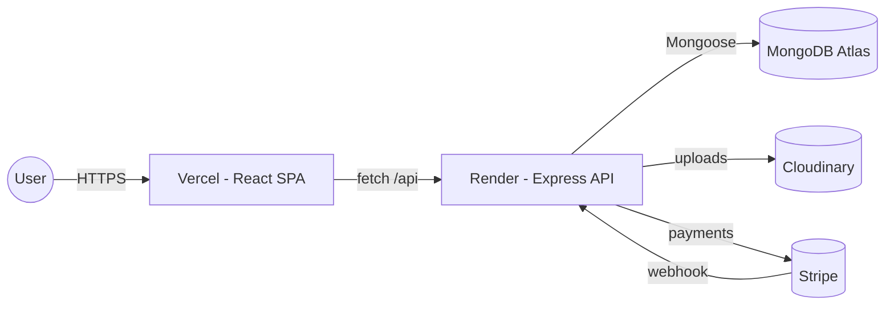
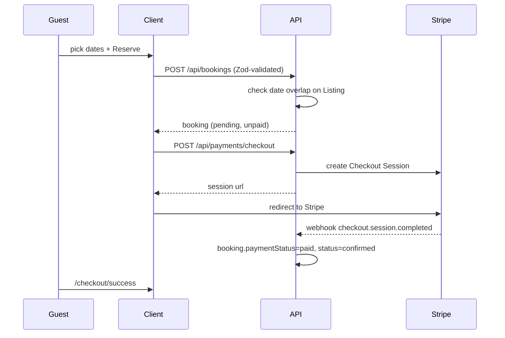

# Kismayo Airbnb — Full MERN Clone

A production-grade Airbnb clone built with MongoDB, Express, React, and Node.js.

Mirrors the core Airbnb experience: browse and search listings, book stays with date-availability checks, leave reviews, manage wishlists, host listings, take payments through Stripe (test mode), and an admin panel for moderation — all with **Zod** validation, a **global error middleware**, and ready to run via **Docker**.

---

## Features

### Guests
- Sign up / log in (JWT access token + httpOnly refresh cookie, auto-refresh).
- Browse homes with a category bar, full-text search, geographic search, and price/amenity filters.
- Interactive **Leaflet** map with price-pin markers.
- Listing detail with photo gallery, host info, amenities, location map, reviews.
- **Sticky booking widget** with date picker, guest selector, live price breakdown, service fee.
- **Stripe Checkout** (test mode) — booking auto-confirmed via webhook.
- Wishlist, Trips page, leave reviews on confirmed/completed stays.

### Hosts
- Host dashboard with stats (listings, bookings, earnings).
- Multi-section **new listing form** (basics, location with **click-to-place map pin**, photos via Cloudinary, amenities, pricing).
- Manage bookings (confirm / cancel / complete).
- Edit & delete listings.

### Admin
- Stats overview (users, hosts, listings, bookings, reviews, revenue).
- Manage users and listings (delete with Cloudinary cleanup).

### Engineering
- **Zod** schemas on every mutating endpoint via a `validate(schema)` middleware.
- **Global error middleware** mapping Zod / Mongoose / JWT / duplicate-key errors to consistent JSON.
- `ApiError` class + `asyncHandler` to keep controllers clean.
- Rate limiting, Helmet, CORS, gzip, cookie parsing.
- Winston logger.
- Geospatial 2dsphere index for map / bbox search.
- Docker + docker-compose for one-command local dev.
- GitHub Actions CI (lint + build).

---

## Tech Stack

**Frontend**: React 18, Vite, React Router, Tailwind CSS, Zustand, React Query, React Hook Form + Zod, Leaflet, Stripe.js, lucide-react.

**Backend**: Node.js, Express, MongoDB + Mongoose, JWT, bcryptjs, Zod, Stripe SDK, Multer + Cloudinary, Helmet, CORS, express-rate-limit, Winston.

**Infra**: Docker, docker-compose, MongoDB Atlas, Cloudinary, Stripe.

---

## Architecture



### Booking & payment flow



---

## Repository Layout

```
kismayo-airbnb/
├── client/                        # React + Vite (frontend)
│   ├── src/
│   │   ├── pages/                 # Home, Search, ListingDetail, Login, Register, Profile,
│   │   │                          # Trips, Wishlist, HostDashboard, HostListingForm, Admin,
│   │   │                          # CheckoutSuccess, CheckoutCancel, NotFound
│   │   ├── components/            # Navbar, Footer, ListingCard, ListingGrid, CategoryBar,
│   │   │                          # SearchBar, BookingWidget, MapView, LocationPicker,
│   │   │                          # ImageGallery, ImageUploader, ReviewForm, Reviews
│   │   ├── hooks/useAuth.js
│   │   ├── lib/                   # api.js (axios + interceptors), zodSchemas.js, constants.js
│   │   └── store/                 # auth.store.js, wishlist.store.js (Zustand)
│   ├── Dockerfile, nginx.conf, vite.config.js, tailwind.config.js
│
├── server/                        # Express API (backend)
│   ├── src/
│   │   ├── config/                # env.js, db.js, cloudinary.js, stripe.js
│   │   ├── models/                # User, Listing, Booking, Review
│   │   ├── routes/                # auth, listing, booking, review, wishlist, upload, payment, admin
│   │   ├── controllers/
│   │   ├── middleware/            # auth, requireRole, validate, errorHandler, notFound
│   │   ├── validators/            # Zod schemas
│   │   ├── utils/                 # ApiError, asyncHandler, jwt, logger, seed
│   │   ├── app.js, server.js
│   └── Dockerfile, .env.example
│
├── docker-compose.yml
├── .github/workflows/ci.yml
└── package.json                   # workspaces root (concurrently scripts)
```

---

## Quick Start (local, no Docker)

### Prerequisites
- Node.js **20+** and npm
- A MongoDB instance (local install **or** free MongoDB Atlas cluster)

### 1. Install
```bash
git clone <your-repo-url> kismayo-airbnb
cd kismayo-airbnb
npm install --workspaces
```

### 2. Configure the backend
```bash
cp server/.env.example server/.env
# edit server/.env — at minimum set MONGO_URI and JWT secrets
```

### 3. Configure the frontend
```bash
cp client/.env.example client/.env
# default points to http://localhost:5000/api
```

### 4. Seed the database (optional, recommended)
```bash
npm run seed
```
This creates demo accounts:
- `admin@kismayo-airbnb.com` / `admin1234` — admin
- `amina@example.com`, `yusuf@example.com`, `layla@example.com` / `password123` — hosts
- `guest@example.com` / `password123` — guest

…and ~12 listings across East Africa and beyond.

### 5. Run dev
```bash
npm run dev
```
- API: http://localhost:5000
- Client: http://localhost:5173

---

## Quick Start with Docker

```bash
# from repo root
docker compose up --build
```
- Mongo: localhost:27017
- API: http://localhost:5000
- Client: http://localhost:5173

Seed inside the container:
```bash
docker compose exec server node src/utils/seed.js
```

---

## Environment Variables

### `server/.env`
| Var | Description |
|---|---|
| `PORT` | API port (default 5000) |
| `NODE_ENV` | `development` \| `production` |
| `CLIENT_URL` | Allowed CORS origin (e.g. `https://kismayo-airbnb.vercel.app`) |
| `MONGO_URI` | MongoDB connection string |
| `JWT_SECRET` | Access token secret |
| `JWT_REFRESH_SECRET` | Refresh token secret |
| `JWT_EXPIRES_IN` | Access token TTL (default `15m`) |
| `JWT_REFRESH_EXPIRES_IN` | Refresh token TTL (default `7d`) |
| `CLOUDINARY_CLOUD_NAME` / `CLOUDINARY_API_KEY` / `CLOUDINARY_API_SECRET` | Image hosting (optional — falls back to base64) |
| `STRIPE_SECRET_KEY` | Stripe secret (test mode) |
| `STRIPE_WEBHOOK_SECRET` | Stripe webhook signing secret |
| `STRIPE_CURRENCY` | Default `usd` |

### `client/.env`
| Var | Description |
|---|---|
| `VITE_API_URL` | API base URL, e.g. `https://kismayo-api.onrender.com/api` |

---

## API Reference (high level)

| Method | Path | Auth | Description |
|---|---|---|---|
| POST | `/api/auth/register` | – | Register (Zod) |
| POST | `/api/auth/login` | – | Login |
| POST | `/api/auth/refresh` | cookie | Refresh access token |
| POST | `/api/auth/logout` | – | Clear refresh cookie |
| GET | `/api/auth/me` | ✓ | Current user |
| PATCH | `/api/auth/me` | ✓ | Update profile |
| GET | `/api/listings` | – | Search/filter (city, dates, guests, price, amenities, category, bbox, sort) |
| POST | `/api/listings` | ✓ | Create listing (auto-promotes guest → host) |
| GET | `/api/listings/:id` | – | Listing detail |
| PATCH | `/api/listings/:id` | owner/admin | Update |
| DELETE | `/api/listings/:id` | owner/admin | Delete |
| GET | `/api/listings/:id/availability` | – | Booked date ranges |
| GET | `/api/listings/:id/reviews` | – | Reviews |
| GET | `/api/listings/mine` | ✓ | Hosting listings |
| POST | `/api/bookings` | ✓ | Create booking (overlap-checked) |
| GET | `/api/bookings/me` | ✓ | My trips |
| GET | `/api/bookings/host` | ✓ | Bookings on my listings |
| PATCH | `/api/bookings/:id/status` | host/guest | Confirm/cancel/complete |
| POST | `/api/reviews` | ✓ | Create review (one per booking) |
| POST/DELETE/GET | `/api/wishlist[/:id]` | ✓ | Wishlist mgmt |
| POST | `/api/uploads` | ✓ | Multipart image upload → Cloudinary |
| POST | `/api/payments/checkout` | ✓ | Create Stripe Checkout Session |
| POST | `/api/payments/webhook` | Stripe sig | Webhook (raw body) |
| GET/DELETE | `/api/admin/users[/:id]` | admin | Users |
| GET/DELETE | `/api/admin/listings[/:id]` | admin | Listings |
| GET | `/api/admin/stats` | admin | Counts + revenue |

All mutating routes return:
```json
{ "success": true, "data": ... }
```
Errors return:
```json
{ "success": false, "message": "Validation failed", "code": "VALIDATION_ERROR", "errors": { "body.email": ["Invalid email"] } }
```

---

## Deployment

### 1. MongoDB Atlas
1. Create a free M0 cluster.
2. Database Access → create user (password auth).
3. Network Access → IP allowlist `0.0.0.0/0` (or specific IPs).
4. Copy the connection string → `MONGO_URI`.

### 2. Cloudinary
1. Sign up (free).
2. Copy Cloud name, API Key, API Secret.

### 3. Stripe (test mode)
1. Get **Secret key** and **Publishable key** from the Stripe dashboard in *Test mode*.
2. Webhooks → add endpoint `https://<your-api>/api/payments/webhook` listening for `checkout.session.completed`, `checkout.session.expired`, `payment_intent.payment_failed`.
3. Copy the **Signing secret** → `STRIPE_WEBHOOK_SECRET`.

### 4. Deploy the backend on Render
- New **Web Service** → connect this repo, root directory `server/`.
- Build command: `npm install`
- Start command: `node src/server.js`
- Add all env vars from the table above. Set `CLIENT_URL` to your Vercel URL.
- Deploy. Note the public URL, e.g. `https://kismayo-api.onrender.com`.

### 5. Deploy the frontend on Vercel
- New project → root directory `client/`.
- Framework preset: **Vite**.
- Build command: `npm run build`. Output: `dist`.
- Env var: `VITE_API_URL=https://kismayo-api.onrender.com/api`.
- Deploy.

### 6. After deploy
- Update Stripe webhook URL to the new Render URL.
- In Render env vars, set `CLIENT_URL` to the Vercel URL.
- Visit the Vercel URL — sign up, create a listing, book a stay, pay with Stripe test card `4242 4242 4242 4242`.

### Alt: Railway (backend) or Netlify (frontend)
- **Railway**: New service → repo → set Root `server/` → add env vars → expose port 5000.
- **Netlify**: New site from Git → base directory `client/`, build `npm run build`, publish `client/dist`.

---

## Useful Commands

```bash
npm run dev          # run client + server together
npm run seed         # seed database
npm run build        # build client (and noop server)
npm run docker:up    # docker compose up --build
npm run docker:down  # docker compose down
npm run lint         # lint both packages
```

---

## Test Credentials (after seeding)

| Role | Email | Password |
|---|---|---|
| Admin | `admin@kismayo-airbnb.com` | `admin1234` |
| Host | `amina@example.com` | `password123` |
| Host | `yusuf@example.com` | `password123` |
| Host | `layla@example.com` | `password123` |
| Guest | `guest@example.com` | `password123` |

Stripe test card: `4242 4242 4242 4242`, any future expiry, any CVC.

---

## License

MIT — built as a learning project. Not affiliated with Airbnb, Inc.
